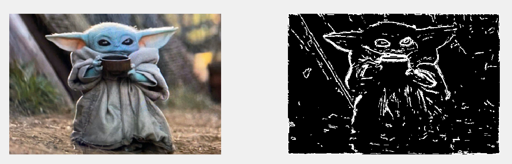
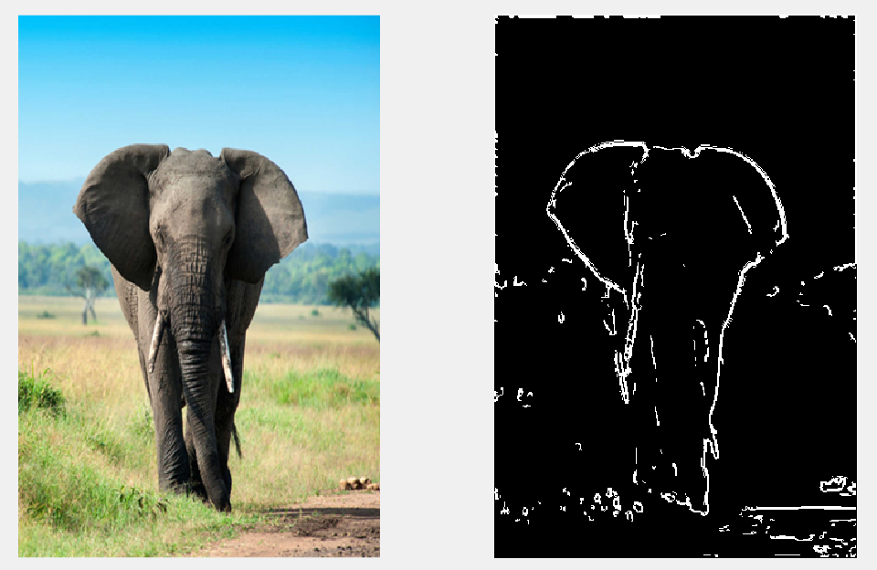
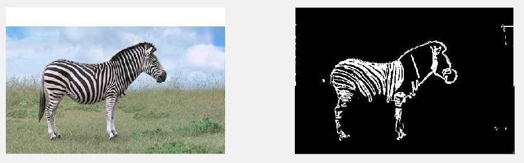

# Image_segmentation_via_boundary
Image segmentation via object boundaries using combined methods.

The ```segment_image.m``` function is used to do the segmentation, how to use is outlined in ```segtest.m```, the parameters are tunned with respect to images of size 321x481 or 481x321, so it would be better to resize the image beforehand.




